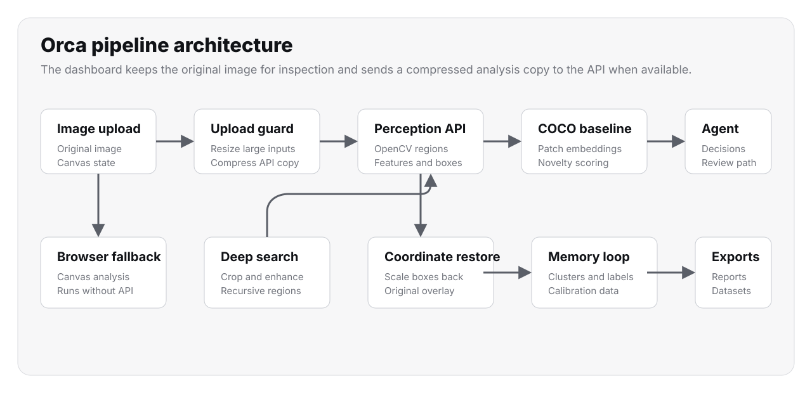

Orca is a model-driven image intelligence dashboard. It can run fully in the browser for static hosting, and it can use the Python/OpenCV API for stronger analysis, baseline novelty scoring, memory, and human review.



## What It Includes

- Static browser-side analyzer for GitHub Pages or any static host.
- Optional typed Pydantic contracts for the Python pixel-to-agent bridge.
- OpenCV perception engine that groups nearby visual evidence into pattern regions, then returns bounding boxes, anomaly scores, visual features, and embeddings.
- Optional domain baseline model that learns normal image patch embeddings from COCO, astronomy, satellite, or inspection datasets.
- Recursive deep search that zooms into suspicious regions, enhances crops, and builds a typed search tree.
- Canvas zoom and pan controls for inspecting image evidence without zooming the browser page.
- Pattern profile graph under the inspection canvas for comparing score, confidence, and novelty.
- Investigation Timeline that records image upload, prompt biasing, first-pass regions, crop refinement, deep-search nodes, and final evidence.
- Pattern Clustering View backed by local vector-style memory so recurring unknown regions can be grouped over time.
- Human label feedback loop for renaming a pattern and storing that label for future matching.
- Before/After Evidence Viewer with original crop, enhanced crop, edge map, heatmap, and deep-search attachment.
- Confidence Calibration panel for marking true positives, false positives, uncertain findings, and ignored findings.
- Export tools for JSON evidence bundles, CSV candidate rows, YOLO labels, COCO annotations, annotated PNGs, and printable PDF reports.
- Project Sessions that save image state, findings, deep-search tree, timeline, and notes in browser storage.
- Open-vocabulary search notes that bias candidate ranking toward what the reviewer is searching for.
- Model Comparison panel for browser analysis, FastAPI/OpenCV analysis, baseline novelty, calibration lift, and future custom models.
- Dataset Builder that turns reviewed candidates into positive, negative, uncertain, and ignored training examples.
- Dynamic refinement for low-confidence candidates.
- JSONL vector memory with cosine similarity for recurring unknown patterns.
- Human-in-the-loop review queue.
- Browser dashboard for image upload, findings, reports, zoom, graphing, and review actions.
- API upload compression so large satellite or inspection images stay below hosted payload limits while canvas overlays remain aligned to the original image.
- FastAPI-compatible backend for local or hosted API analysis.

## Run

### Static Browser Mode

Open `static/index.html` through GitHub Pages or any static host. Analyze and Deep Search run in the browser using Canvas image processing when no API is configured or reachable.

Static mode supports:

- Image upload.
- Pattern-region detection.
- Deep Search.
- Canvas zoom and pan.
- Pattern profile graph.
- Investigation timeline.
- Pattern clustering.
- Label feedback.
- Evidence crop comparison.
- Calibration.
- Export bundles.
- Saved sessions.
- Dataset export.

### Optional Python API Mode

```bash
python scripts/create_sample_images.py
uvicorn app.main:app --reload --port 8000
```

Open `http://127.0.0.1:8000` and upload `data/samples/manufacturing_unknown_patterns.png`.

You can also run from inside `app/`:

```bash
python main.py
```

## Analyze Images

Use **Analyze** for the first-pass pattern search. Orca groups nearby points, edges, and high-contrast details into larger candidate pattern regions so satellite/city-light style images do not show only isolated point marks.

Use **Deep Search** for recursive inspection. Orca crops each suspicious region, enhances it, zooms in, and searches again up to the selected depth.

Use **Search note** to describe what you are looking for, such as `road-like grid patterns near bright clusters`. Orca uses the note as a ranking bias so relevant candidates appear first without requiring a fixed object class.

Use the canvas zoom controls beside **Inspection**:

- `+` zooms into the image.
- `-` zooms out.
- `100%` resets zoom and pan.
- Mouse wheel zooms over the canvas.
- Drag the canvas to pan when zoomed in.

If no API is reachable, Orca automatically falls back to browser-side analysis. To point the dashboard at an API, set:

```js
localStorage.setItem("ORCA_API_BASE", "https://your-orca-api.example.com")
```

Refresh the page after setting `ORCA_API_BASE`.

## Investigation Workspace

The right-side workspace is split into focused inspection views:

- **Timeline**: an audit trail of each run, from upload to candidate discovery and deep-search traversal.
- **Clusters**: recurring unknown patterns grouped from saved embeddings and human labels.
- **Evidence**: candidate crops shown as original, enhanced, edge map, and heatmap views.
- **Calibration**: reviewer decisions that separate true positives from false positives and uncertain results.
- **Compare**: browser analyzer, FastAPI/OpenCV analyzer, baseline novelty, confidence, and calibration lift in one panel.
- **Dataset**: export accepted positives, rejected negatives, uncertain items, and ignored regions to JSON, CSV, YOLO, or COCO formats.
- **Sessions**: save and reopen an investigation with image preview, findings, deep-search tree, notes, and timeline.

## Pipeline Architecture

The browser keeps the original image for inspection, zoom, pan, crops, and annotated exports. When an API is configured, Orca creates a compressed JPEG analysis copy before upload. This prevents hosted request-size failures while scaling returned bounding boxes back onto the original image.

The active baseline is loaded by the API and contributes `baseline_similarity` and `model_novelty` to each candidate. If the API is unreachable, the same dashboard falls back to browser-side Canvas analysis and still supports timeline, clusters, evidence, calibration, sessions, and dataset export.

## Train A COCO Baseline

COCO is large, so start with a tiny subset:

```bash
python scripts/train_coco_baseline.py --download --count 8
```

This downloads a few images from `http://images.cocodataset.org/val2017/`, extracts patch embeddings, and writes `data/coco_baseline.json`. Restart the API after training so the agent uses the baseline.

Once trained, each candidate includes:

- `baseline_similarity`: nearest COCO patch similarity.
- `model_novelty`: how unlike the COCO baseline the candidate looks.

## Train A Space Baseline

For NASA or astronomy images, COCO is the wrong normal baseline. Download the Kaggle astronomy dataset first:

```text
https://www.kaggle.com/datasets/razaimam45/spacenet-an-optimally-distributed-astronomy-data
```

Unzip it into a local folder such as `data/space`, then train:

```bash
python scripts/train_space_baseline.py --image-dir data/space --model-path data/space_baseline.json
```

Or use the Kaggle CLI download path:

```bash
export KAGGLE_API_TOKEN="your-kaggle-token"
python -m pip install kaggle
python scripts/train_space_baseline.py --download --image-dir data/space --model-path data/space_baseline.json
```

To use that baseline locally:

```bash
ORCA_BASELINE_FILE=space_baseline.json uvicorn app.main:app --reload --port 8000
```

If `data/space_baseline.json` is bundled with the app, Orca prefers it over `data/coco_baseline.json`. The dashboard model label changes to `Space` when the active baseline source is the Kaggle astronomy dataset.

## Test

```bash
pytest
```

## Replace The CV Model

Swap `PerceptionEngine.analyze_array` in `app/perception.py` with your trained model inference. Keep returning `AnomalyCandidate` objects so the agent stays type-safe and independent from raw tensors.

The key contract is:

```python
AnomalyCandidate(
    bbox=BoundingBox(...),
    anomaly_score=0.0,
    confidence=0.0,
    features=VisualFeatures(...),
    embedding=[...],
)
```
